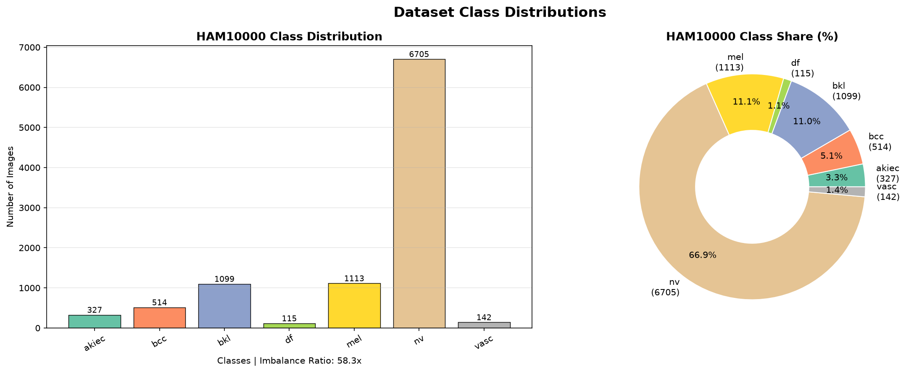
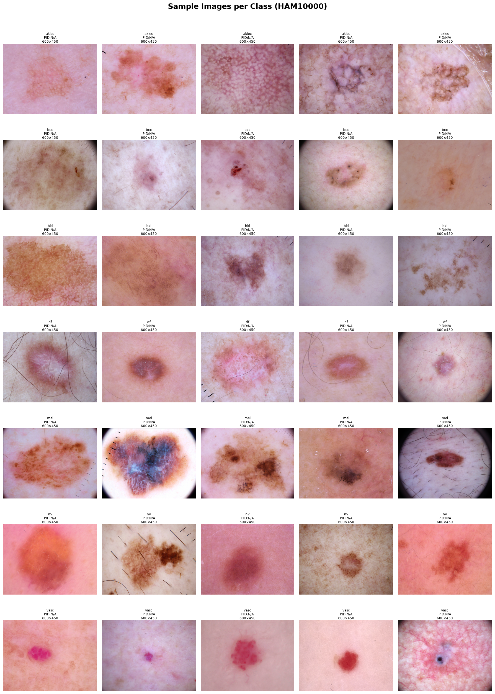

# Dataset Validation Report
*Generated automatically — Dual-Branch CNN Dermoscopy Project*
**Date**: 2026-07-10 17:14
---
## 1. HAM10000
| Metric | Value |
|--------|-------|
| Total images on disk | 10,015 |
| Metadata rows | 10,015 |
| Missing images | 0 |
| Extra images | 0 |
| Corrupted images (sample) | 0 |
| Duplicate filenames | 0 |
| Invalid labels | 0 |
| Unique patients | 7470 |
| Max images/patient | 6 |
| Mean images/patient | 1.34 |

### Class Distribution

| Class | Full Name | Count | % |
|-------|-----------|-------|---|
| akiec | Actinic keratoses / Bowen | 327 | 3.3% |
| bcc | Basal cell carcinoma | 514 | 5.1% |
| bkl | Benign keratosis | 1,099 | 11.0% |
| df | Dermatofibroma | 115 | 1.1% |
| mel | Melanoma | 1,113 | 11.1% |
| nv | Melanocytic nevi | 6,705 | 66.9% |
| vasc | Vascular lesions | 142 | 1.4% |
| **TOTAL** | | **10,015** | **100%** |

> **Class Imbalance Ratio**: 58.3x (majority/minority)

---
## 2. ISIC 2019
| Metric | Value |
|--------|-------|
| Total images on disk | 0 |
| Metadata rows | 0 |
| Errors | ISIC_2019_Training_GroundTruth.csv not found |

---
## Sample Images

