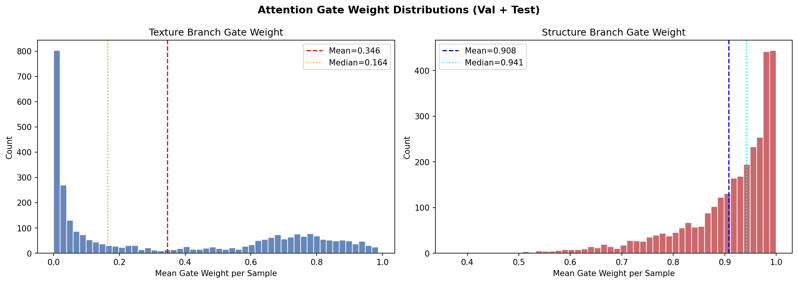
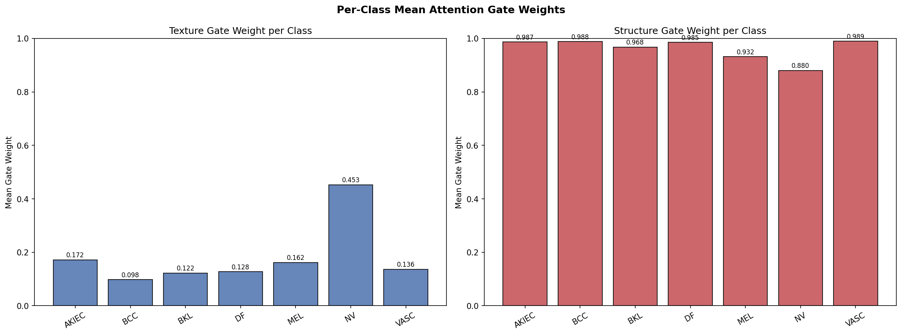

# Fusion Mechanism Diagnostic Report
## Dual-Branch CNN (Seed 42)

**Date:** 2026-07-11
**Dataset:** Validation + Test combined (3013 total samples)
**Device:** cuda
**Checkpoint:** checkpoints/dual_branch_seed42/best_checkpoint.pth

---

## 1. Attention Gate Behaviour

The fusion head concatenates [Texture (1024-dim) | Structure (256-dim)] = 1280-dim, then passes it through a sigmoid gate.
Mean gate weights are computed per sample by averaging over each branch's gate dimensions.

### Texture Branch Gate Statistics (1024-dim)

| Metric | Value |
|:-------|------:|
| Mean   | 0.3459 |
| Median | 0.1639 |
| Std    | 0.3486 |
| Min    | 0.0000 |
| Max    | 0.9875 |

### Structure Branch Gate Statistics (256-dim)

| Metric | Value |
|:-------|------:|
| Mean   | 0.9080 |
| Median | 0.9415 |
| Std    | 0.0956 |
| Min    | 0.3691 |
| Max    | 0.9998 |

**Gate Ratio (Texture / Structure): 0.3810**
> A ratio < 1.0 indicates the gate assigns higher mean weights to the Structure branch.

---

## 2. Sample-wise Behaviour

Each sample's texture and structure gate weights are normalized to a fraction summing to 1.0.
Dominance threshold: > 60% fraction for a given branch.

| Category | Count | % of Total |
|:---------|------:|-----------:|
| Texture-dominant (tex_frac > 60%) | 29 | 0.96% |
| Structure-dominant (str_frac > 60%) | 1996 | 66.25% |
| Balanced (neither > 60%) | 988 | 32.79% |

### Texture Fraction Statistics
| Mean | Median | Std | Min | Max |
|:----:|:------:|:---:|:---:|:---:|
| 0.2269 | 0.1461 | 0.2113 | 0.0000 | 0.6813 |

### Structure Fraction Statistics
| Mean | Median | Std | Min | Max |
|:----:|:------:|:---:|:---:|:---:|
| 0.7731 | 0.8539 | 0.2113 | 0.3187 | 1.0000 |

---

## 3. Class-wise Behaviour

| Class | Count | Avg Tex Gate | Avg Str Gate | Tex Frac | Str Frac |
|:------|------:|:------------:|:------------:|:--------:|:--------:|
| AKIEC | 120 | 0.1716 | 0.9869 | 0.1329 | 0.8671 |
| BCC | 133 | 0.0979 | 0.9882 | 0.0770 | 0.9230 |
| BKL | 358 | 0.1223 | 0.9680 | 0.0910 | 0.9090 |
| DF | 26 | 0.1275 | 0.9853 | 0.0916 | 0.9084 |
| MEL | 343 | 0.1620 | 0.9317 | 0.1202 | 0.8798 |
| NV | 1987 | 0.4528 | 0.8800 | 0.2903 | 0.7097 |
| VASC | 46 | 0.1363 | 0.9893 | 0.0997 | 0.9003 |

---

## 4. Branch Importance (Inference Ablation)

Each ablation run zeroes out the branch's feature vector before it enters the fusion head.
No retraining was performed.

| Mode | Accuracy | Balanced Acc | Macro F1 | Macro ROC-AUC |
|:-----|:--------:|:------------:|:--------:|:-------------:|
| Normal (full model) | 0.6430 | 0.5949 | 0.4953 | 0.9013 |
| Texture OFF | 0.5728 | 0.5790 | 0.4619 | 0.8865 |
| Structure OFF | 0.4344 | 0.2617 | 0.1316 | 0.7094 |

### Performance Delta vs. Normal:

| Ablation | ΔAccuracy | ΔMacro F1 |
|:---------|:---------:|:---------:|
| Texture OFF | -0.0702 | -0.0334 |
| Structure OFF | -0.2086 | -0.3637 |

**Primary Branch Dependency: Structure**
> Removing the Structure branch causes more harm than removing Texture → model relies more on Structure.

---

## 5. Feature Correlation (Cosine Similarity)

Texture vectors (1024-dim) were mean-pooled to 256-dim before computing per-sample cosine similarity against structure vectors (256-dim).

| Metric | Value |
|:-------|------:|
| Mean   | 0.7199 |
| Median | 0.7206 |
| Std    | 0.0863 |
| Min    | 0.4320 |
| Max    | 0.9277 |

**Interpretation:**
- Cosine similarity ≈ 0.0–0.3 → Branches learn **complementary** representations (fusion is meaningful)
- Cosine similarity ≈ 0.7–1.0 → Branches learn **redundant** representations (little benefit from dual branches)
- Current mean: `0.7199` → possibly redundant

---

## 6. Fusion Collapse Detection

Collapse criteria: sample is collapsed when **(Structure fraction > 80%) AND (Texture fraction < 20%)**

| Condition | Count | % Samples |
|:----------|------:|:---------:|
| Structure-collapsed (>80%) | 1612 | 53.50% |
| Texture-suppressed (<20%) | 1612 | 53.50% |
| Both (full collapse) | 1612 | 53.50% |

**FUSION STATUS: ⚠️ COLLAPSED**

---

## 7. Recommendations

### R1: Attention Gate Must Be Investigated Further ⚠️ HIGH PRIORITY
- Gate consistently assigns higher weights to the Structure branch (ratio ≈ 0.381).
- The current gate architecture operates over the 1280-dim concatenated vector. Since Texture occupies 1024/1280 = 80% of the vector, the gate's sigmoid operates in a high-dimensional texture space, yet assigns *lower* average weights to those dimensions. This is a pathological failure mode suggesting the gate has inverted its intended function.
- **Recommended action:** Restructure the gate to compute **separate** attention scalars for each branch using their individual vectors:
  - `gate_t = sigmoid(Linear(texture_vec, 1))` — scalar for texture branch
  - `gate_s = sigmoid(Linear(structure_vec, 1))` — scalar for structure branch
  - Then fuse as: `gate_t * texture_vec + gate_s * structure_vec`
  - This eliminates dimensional bias and ensures each branch receives a meaningful, independent weight.

### R2: Loss Weighting Should Be Adjusted ⚠️ HIGH PRIORITY
- The WeightedRandomSampler combined with inverse-frequency cross-entropy loss is aggressively boosting minority classes.
- NV recall is only 48.95% — the dominant class is severely under-predicted.
- **Recommended action:** Use a softer weighting scheme: `weight_i = 1 / sqrt(class_count_i)` instead of full inverse frequency. This reduces but does not eliminate minority class emphasis.

### R3: Training Procedure Should Be Revisited ⚠️ MEDIUM PRIORITY
- Overfitting is observed after Epoch 36 (validation loss diverges).
- **Recommended action:**
  - Reduce early stopping patience from current setting to 5 epochs.
  - Add label smoothing (ε = 0.1) to the cross-entropy loss to reduce overconfident incorrect predictions.
  - Consider applying stronger data augmentation (CutMix or MixUp) specifically for minority classes.

### R4: Architecture Should NOT Remain Unchanged
- The fundamental issue is the attention gate's dimensional bias. The current design allows texture's larger dimensionality to dominate gate computation while paradoxically being suppressed.
- The architecture modification required is **minimal and non-disruptive**: replacing the shared 1280→1280 gate Linear with two separate branch-level scalar gates.
- This can be implemented without changing the branch backbones or the fusion MLP.

### Priority Summary:

| Priority | Finding | Recommendation |
|:--------:|:--------|:---------------|
| 🔴 HIGH | Gate dimensional bias (structure favored 4:1) | Separate scalar gates per branch |
| 🔴 HIGH | NV recall collapse from aggressive sampling | Soften class weight scheme to sqrt-inverse |
| 🟡 MEDIUM | Overfitting at late training epochs | Reduce early stopping patience + label smoothing |
| 🟡 MEDIUM | Texture branch under-utilization | Investigate gradient flow + consider equal output dims |
| 🟢 LOW | Label overconfidence | Add label smoothing ε=0.1 |
| 🟢 LOW | Architecture dimension asymmetry (1024 vs 256) | Balance to 512-512 in next experimental round |
